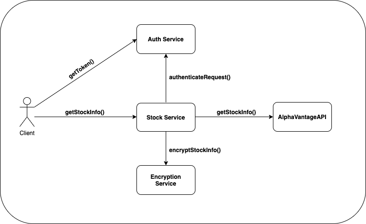
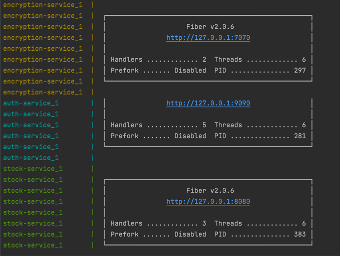
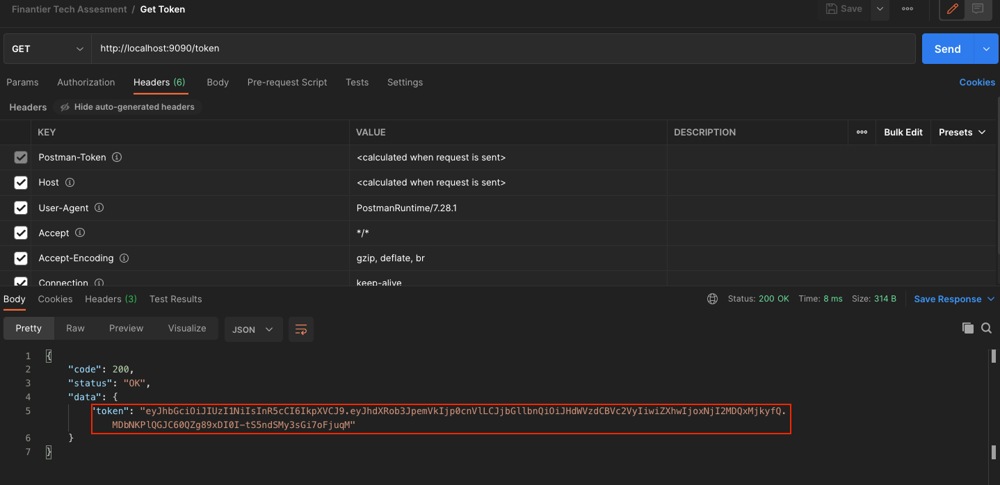
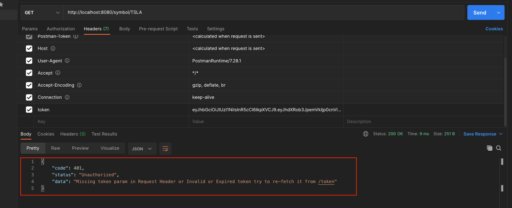
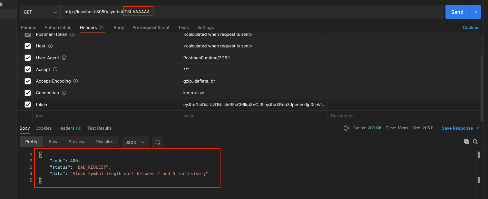
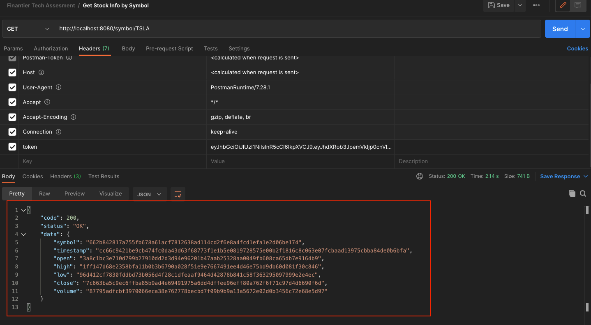
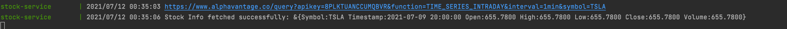

# Simple Stock Info Retrieval Microservices
Notes : 
    - Really sorry if I don't implement TDD, the timeline to tight, only have 1 days :(
    - I implement encrypt in fields level
    - Need to generate token first before calling getStockInfoAPI
    - Token will be expired after 10 minutes
## High Level Diagram



- [Stock Service](stock-service/README.md)
- [Auth Service](auth-service/README.md)
- [Encryption Service](encryption-service/README.md)

Postman Collection can be found [HERE](Postman_Collection.json)

## How to Run

```bash
docker compose up
```

## Attachments

#### Server Running



#### Get Token API



#### Get Stock Info Invalid Token



#### Get Stock Info Invalid Stock Symbol



#### Get Stock Info Success



